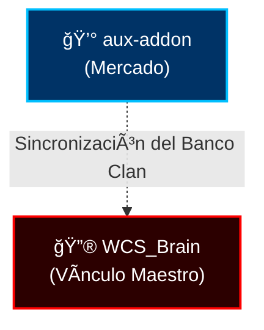

# � AUX Trading System - Turtle WoW Edition

## Sistema Profesional de Trading y Monopolio

**Versión:** 5.1.0 (Full Lua 5.0 Audit & Stable)  
**Autor:** Elnazzareno (DarckRovert)  
**Clan:** El Séquito del Terror 🔮  
**Servidor:** Turtle WoW  

---

## 📖 Descripción

 **AUX Trading System** ha sido reescrito y optimizado para ser la herramienta definitiva de economía en Turtle WoW. No solo permite escanear subastas, sino que incluye algoritmos avanzados para detectar **Monopolios** y realizar **Sniping** de alta velocidad sin afectar el rendimiento del juego.

### � Séquito Ecosystem Compatible (SquadMind Intelligence)
Este addon es ahora la **Inteligencia de Mercado** de la Mente de Enjambre. 


Comparte datos de precios y oportunidades de trading con la red Séquito (`WCS_Brain`), valorando automáticamente los bienes del clan y permitiendo dominar la economía de Turtle WoW.

### ✨ Nuevas Características (v4.1)

- **� Módulo de Monopolio 2.0**:
    - **Memoria Persistente**: Acumula datos de múltiples escaneos para un análisis de mercado profundo.
    - **Algoritmo de Candidatos**: Detecta automáticamente items con bajo stock y alta demanda.
    - **Interfaz Mejorada**: Lista con scroll infinito e iconos reales de los items.
- **� Sniper Avanzado**:
    - **Escaneo de 2 Pasadas**: Análisis contextual de precios en la misma página (detecta ofertas sin historial previo).
    - **Arquitectura Event-Driven**: Elimina el lag y las condiciones de carrera al esperar eventos del servidor.
- **🚀 Rendimiento**:
    - **Gestión de Memoria `T`**: Uso de tablas reciclables para evitar "tirones" (garbage collection) durante escaneos masivos.
    - **Cero Lag**: Optimizado para clientes 1.12.

---

## 🧠 ¿Cómo Funciona?

El siguiente diagrama explica el flujo de datos dentro del addon:

```text
+-------------------+       +----------------------+
|  Casa de Subastas | ----> |   Motor de Escaneo   |
+-------------------+       +----------------------+
                                      |
                                      v
                            +----------------------+
                            |  Procesador de Datos |
                            +----------------------+
                                      |
                  +-------------------+--------------------+
                  |                                        |
          +-------v-------+                        +-------v-------+
          | Módulo Sniper |                        |   Full Scan   |
          +-------+-------+                        +-------+-------+
                  |                                        |
                  +--------------->   +   <----------------+
                                      |
                            +---------v---------+
                            |  Gestor de Memoria |
                            |    (Deduplicación) |
                            +---------+---------+
                                      |
                            +---------v---------+
                            |  Motor de Análisis |
                            |     (Monopolio)    |
                            +---------+---------+
                                      |
                            +---------v---------+
                            | Interfaz de Usuario|
                            +--------------------+
```

---

## 📋 Módulos Principales

### 1. � Monopolio (Dominio del Mercado)
El corazón estratégico del addon.
- **Funcionamiento**: Analiza la oferta total de un item y calcula si es viable comprar todo el stock para revenderlo a un precio mayor.
- **Uso**:
    1. Ejecuta un **Full Scan** o deja el **Sniper** corriendo un rato.
    2. Ve a la pestaña **Monopolio**.
    3. Clic en **"Buscar Oportunidades"**.
    4. El sistema te mostrará items con **Score Alto** (poca competencia, buen margen).

### 2. � Sniper (Oportunidades en Tiempo Real)
Velocidad y precisión para cazar gangas.
- **Funcionamiento**: Escanea continuamente la última página de la subasta (lo recién posteado).
- **Lógica Dual**:
    - *Con Historial*: Compara con el precio medio de los últimos días.
    - *Sin Historial*: Compara el item con otros de la misma página para detectar errores de precio obvios.

### 3. � Search & Buy
La herramienta clásica de búsqueda con filtros avanzados.
- Soporta filtros complejos (e.g., `armor/cloth/50+`).
- Muestra porcentaje de beneficio estimado.


### 4. 💰 Vendor Shuffle (Dinero Gratis)
Compra barato en subasta, vende caro al NPC.
- **Requisito**: Visita vendedores en el juego para que el addon "aprenda" los precios de venta.
- **Uso**:
    1. Abre la pestaña **Vendor Shuffle**.
    2. Dale a **"Buscar Gangas"**.
    3. Compra todo lo que salga en la lista.
    4. Vende esos items a cualquier vendedor NPC.
    5. ¡Beneficio instantáneo sin riesgo!

### 5. ⚙� Configuración (Perfiles)
Adapta el addon a tu estilo de juego.
- **Principiante**: Solo oportunidades muy seguras (alto margen).
- **Intermedio**: Balance entre riesgo y beneficio.
- **Avanzado/Experto**: Para traders agresivos que mueven mucho volumen (márgenes más bajos, mayor riesgo).
- **Opciones**: Activa/Desactiva sonidos, alertas en pantalla y tooltips desde aquí.

---

## 🚀 Instalación y Uso

1.  **Instalación**:
    - Extrae la carpeta `aux-addon` en `.../World of Warcraft/Interface/AddOns/`.
    - **Importante**: Asegúrate de no tener carpetas duplicadas (e.g., `aux-addon/aux-addon`).

2.  **Primeros Pasos**:
    - Abre la subasta y selecciona la pestaña **"Trading"**.
    - Recomendado: Haz un **Full Scan** inicial para poblar la base de datos de precios.

3.  **Comandos**:
    - `/aux` - Abre/Cierra la ventana principal.
    - `/aux scale <n>` - Escala la interfaz (e.g., 1.2).

---

## ⚠� Solución de Problemas Comunes

**P: La lista de Monopolio está vacía.**
R: Necesitas datos. Deja el **Sniper** corriendo unos minutos o haz un **Full Scan**. Ahora el sistema acumula datos automáticamente.

**P: Me salen errores de Lua.**
R: Asegúrate de estar usando la versión correcta para el cliente 1.12. Este addon ha sido parcheado específicamente para evitar errores como `strsplit` (que no existe en 1.12).

---

---

## 📂 Estructura del Proyecto

```text
Interface/AddOns/aux-addon/
├── aux-addon.toc          # Manifiesto (Carga de archivos)
├── aux-addon.lua          # Core
├── tabs/
│   └── trading/           # MÓDULOS DE TRADING (NUEVO)
│       ├── core.lua       # Cerebro del sistema
│       ├── frame.lua      # Gestor de Ventanas y Pestañas
│       ├── sniper.lua     # Lógica del Sniper
│       ├── monopoly.lua   # Lógica de Monopolio
│       ├── monopoly_ui.lua# Interfaz de Monopolio
│       ├── vendor.lua     # Lógica Vendor Shuffle
│       ├── vendor_ui.lua  # Interfaz Vendor Shuffle
│       ├── config_ui.lua  # Panel de Configuración
│       └── ... (otros módulos auxiliares)
└── ...
```

---

## 👥 Créditos

- **Código y Optimización**: Elnazzareno (DarckRovert)
- **Clan**: El Séquito del Terror 🔮
- **Base Original**: Fork de AUX (shirsig) muy modificado.

*"El conocimiento del mercado es poder. El poder genera oro."*
*"El Séquito del Terror."*
---

## ?? Comunidad y Gobernanza

Este proyecto es parte del ecosistema **El Séquito del Terror**. Nos comprometemos a mantener un ambiente sano y profesional:

- ?? **[Código de Conducta](./CODE_OF_CONDUCT.md)**: Nuestras normas de convivencia.
- ?? **[Guía de Contribución](./CONTRIBUTING.md)**: Cómo ayudar a expandir este addon.
- ??? **[Licencia](./LICENSE)**: Este proyecto está bajo la Licencia MIT.

---
