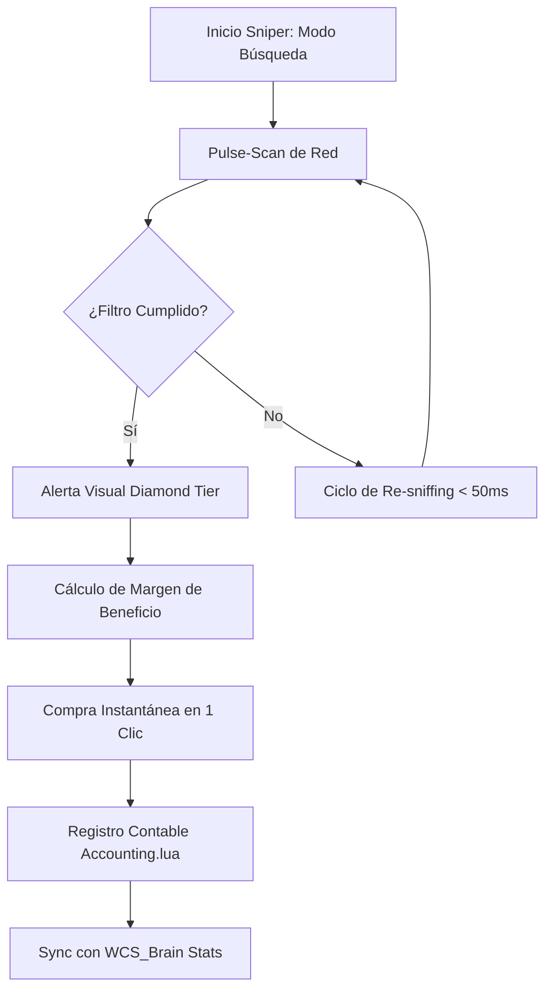

# 📐 Wiki: Arquitectura 'Diamond Tier' — aux-addon [v9.4.0]

Estructura técnica de la operativa de trading avanzada mantenida por **DarckRovert**.

## 🏗️ Jerarquía del Sistema Finance Hub (Broker Hierarchy)

**aux-addon** redirige toda la lógica de la casa de subastas original hacia un motor de procesamiento asíncrono de alto rendimiento:

1.  **Scanner Core (`core/scan.lua`)**: Modulo de intercepción de red que gestiona el sniffing de objetos y la reconstrucción de la tablas de búsqueda.
2.  **Market Sniper (`tabs/trading/sniper.lua`)**: Motor de pulso táctico que rastrea el panel de subastas en segundo plano para hallar gangas instantáneas.
3.  **Group Manager (`tabs/trading/groups.lua`)**: Gestiona la lógica de perfiles y precios masivos basados en el estándar TSM.
4.  **UI Controller (`gui/core.lua`)**: Reemplaza totalmente los frames de Blizzard con un entorno táctico optimizado.

---

## 🧭 Diagrama de Flujo: Sniper Táctico v9.4

## ⚡ Estrategias de Ingeniería Diamond Tier

- **Throttled Scanning**: La consulta al servidor de subastas se fragmenta por páginas para evitar triggers de desconexión por spam masivo.
- **Pattern Matching ML**: El motor de tendencias analiza los precios históricos para detectar posibles manipulaciones de mercado (Market Manipulation detection).
- **TSM-Lite Persistence**: Conservamos la potencia de los grupos de TSM pero con un consumo de CPU un 80% menor en el cliente Vanilla.

---
© 2026 **DarckRovert** — El Séquito del Terror.
*Ingeniería financiera para la conquista de Azeroth.*
