# 📐 Wiki: Arquitectura 'Diamond Tier' — aux-addon [v2.0.1]

Estructura técnica de la operativa de trading avanzada mantenida por **DarckRovert**.

## 🏗️ Jerarquía del Sistema Finance Hub (Broker Hierarchy)

**aux-addon** redirige toda la lógica de la casa de subastas original hacia un motor de procesamiento asíncrono de alto rendimiento:

1.  **Scanner Core (`core/scan.lua`)**: Modulo de intercepción de red que gestiona el sniffing de objetos y la reconstrucción de la tablas de búsqueda.
2.  **Market Sniper (`tabs/trading/sniper.lua`)**: Motor de pulso táctico que rastrea el panel de subastas en segundo plano para hallar gangas instantáneas.
3.  **Group Manager (`tabs/trading/groups.lua`)**: Gestiona la lógica de perfiles y precios masivos basados en el estándar TSM.
4.  **UI Controller (`gui/core.lua`)**: Reemplaza totalmente los frames de Blizzard con un entorno táctico optimizado.

---

## 🧭 Diagrama de Flujo: Sniper Táctico v9.4

```mermaid
graph TD
    A[Inicio Sniper: Modo Búsqueda] --> B[Pulse-Scan de Red]
    B --> C{¿Filtro Cumplido?}
    C -- Sí --> D[Alerta Visual Diamond Tier]
    D --> E[Cálculo de Margen de Beneficio]
    E --> F[Compra Instantánea en 1 Clic]
    F --> G[Registro Contable Accounting.lua]
    G --> H[Sync con WCS_Brain Stats]
    C -- No --> I[Ciclo de Re-sniffing < 50ms]
    I --> B
```

## ⚡ Estrategias de Ingeniería Diamond Tier

- **Throttled Scanning**: La consulta al servidor de subastas se fragmenta por páginas para evitar triggers de desconexión por spam masivo.
- **Pattern Matching ML**: El motor de tendencias analiza los precios históricos para detectar posibles manipulaciones de mercado (Market Manipulation detection).
- **TSM-Lite Persistence**: Conservamos la potencia de los grupos de TSM pero con un consumo de CPU un 80% menor en el cliente Vanilla.

---
© 2026 **DarckRovert** — El Séquito del Terror.
*Ingeniería financiera para la conquista de Azeroth.*

